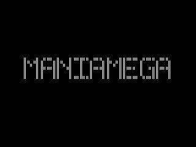
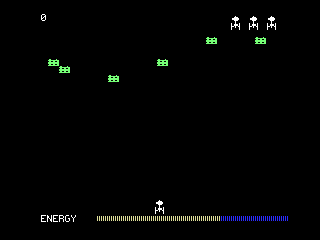

# ManiaMega

A **Megamania-style fixed-screen shooter for the MSX2**, written in C with
[MSXgl](https://github.com/aoineko-fr/MSXgl). It recreates the feel of Activision's
*Megamania* (Atari 2600, 1982): an all-directions wrapping ship, a weaving stream
of enemies, a draining energy clock, and gritty Atari-flavored sound — on real
MSX2 hardware.




## Play it now

A ready-to-run cartridge image is included: [`maniamega.rom`](maniamega.rom) (32 KB).

- **openMSX**: `openmsx -machine C-BIOS_MSX2 -cart maniamega.rom`
- **WebMSX**: open <https://webmsx.org>, set the machine to MSX2, drag the `.rom` in
- **blueMSX / fMSX**: load as a cartridge, machine = MSX2

`C-BIOS_MSX2` is the free BIOS bundled with openMSX, so no copyrighted system ROMs
are needed.

## Controls

| Action | Joystick (port 1) | Keyboard |
|--------|-------------------|----------|
| Move (8-way, wraps left/right) | Stick | Cursor arrows |
| Fire (rapid)                   | Trigger A | Space |
| Start / continue               | Trigger A | Space |
| Quit to title                  | —     | ESC |

## How it plays (like Megamania)

- The **ship** moves in all directions within a lower band and **wraps around** the
  screen horizontally.
- **Rapid multi-shot** upward (up to 3 bullets on screen). Enemies **don't shoot
  back** — the threat is the clock and collisions.
- **Enemies fly as a weaving serpentine stream**: they ride a fixed sine "track",
  scroll across and wrap, and the baseline slowly drifts down. Each wave varies
  direction, speed, amplitude and wavelength. Destroyed enemies are replaced until
  the wave's quota is met.
- A constantly **draining ENERGY bar** (bottom, labelled `ENERGY`) is the real
  pressure — clear the wave before it empties or you lose a ship. It's yellow when
  full and turns red when low.
- **Wave clear** drains the remaining energy into your score as a bonus (blips, no
  text), then the next object type appears (5 types cycle, each a little faster).
- **3 ships**, shown as little icons top-right. Lose one on a hit or empty energy;
  at zero it's **game over**, announced by a descending tune.
- The HUD is deliberately **text-free** like the original: just score digits
  (top-left) and ship icons (top-right). The only screen of words is the title.

## Build from source

You need a C toolchain only indirectly — **MSXgl bundles its own SDCC and Node**,
so a normal clone builds out of the box on Linux/macOS/Windows.

```bash
git clone --recurse-submodules https://github.com/boaglio/maniamega.git
cd maniamega
./build.sh
```

If you already cloned without `--recurse-submodules`:

```bash
git submodule update --init --depth 1
```

The build outputs `out/maniamega.rom` and copies it to `emul/rom/maniamega.rom`.

### Build & run helper

```bash
./run.sh                # build, then launch in openMSX
./run.sh --no-build     # just launch the existing ROM
./run.sh --machine Boosted_MSX2_EN   # use a real MSX2 BIOS instead of C-BIOS
```

## Project layout

| Path | What |
|------|------|
| `maniamega.c`       | The whole game (one file). |
| `mm_sprites.h`      | Ship + 5 enemy types (2 animation frames each). |
| `project_config.js` | MSXgl build settings: `ProjName=maniamega`, `Machine=2` (MSX2), `Target=ROM_32K`. |
| `msxgl_config.h`    | MSXgl feature switches (VDP, sprites, PSG, print…). |
| `build.sh`          | Builds against `./MSXgl`. |
| `run.sh`            | Build + launch in an emulator. |
| `maniamega.rom`     | Prebuilt cartridge image. |
| `.vscode/`          | IntelliSense include paths + build/run tasks. |
| `MSXgl/`            | The engine, as a git submodule. |

## How it works (technical)

- **SCREEN5** (MSX2 bitmap, 256×212, 16 colors), 16×16 hardware sprites.
- Sprite planes: 0 = ship, 1–3 = bullets, 4–9 = the enemy stream, 10–14 = ship icons.
- The game loop is locked to V-Blank via `Halt()` (50/60 Hz).
- Enemy vertical position is derived from X through a 32-entry sine table
  (`g_Sin32` / `EnemyYFor`), so horizontal motion makes the group flow like a snake.
- The energy bar and the big title letters are drawn with the VDP fill command
  `VDP_CommandHMMV`, not with sprites.
- Sprite patterns/colors are reloaded in `PlayGame()` because the title/game-over
  screens call `VDP_ClearVRAM()`, which wipes the sprite pattern/color tables.

### Sound — Atari 2600 (TIA) flavored, on the MSX PSG

The 2600's TIA makes noise with polynomial counters; the MSX AY-3-8910 has square
tones + one LFSR noise generator, so the timbre can't match exactly. ManiaMega
imitates the *character*:

- **Explosion** — the noise period sweeps bright→dark for that gritty TIA rumble,
  with a low descending square-wave "body" tone underneath.
- **Shot** — channel A blends **tone + noise** (mixer enables both) for the buzzy
  TIA "zap", with an accelerating downward pitch sweep.
- Plus a descending **game-over** tune and a rising **wave-clear** jingle.

All tunable via `SHOT_LEN` / `BOOM_LEN` and the sweep constants in `SoundUpdate()`.

## Credits & licensing

- **Code**: original, MIT-licensed (see [`LICENSE`](LICENSE)).
- **Sprites** (`mm_sprites.h`): adapted — resampled from C64 multicolor 12×21 to
  MSX 16×16 mono — from the open-source C64 *Megamania* project by **1888games**
  (<https://github.com/1888games/Megamania-C64->).
- **Engine**: [MSXgl](https://github.com/aoineko-fr/MSXgl) by Guillaume 'Aoineko'
  Blanchard (its own license applies; included as a submodule).
- *Megamania* is © **Activision**. This is a non-commercial, fan-made homage; only
  the game's mechanics (not copyrightable) and original/adapted assets are used —
  no original Activision ROM data is included.
